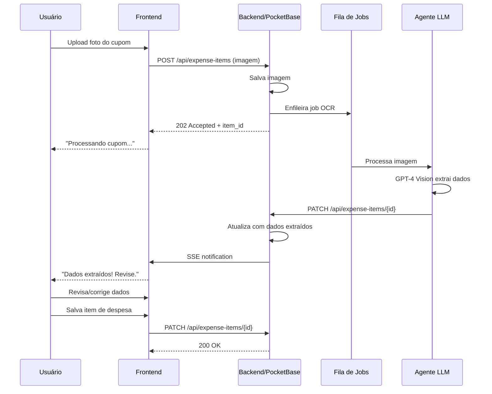

# PRD - Sistema de Reembolso de Despesas com IA

**Versão:** 1.0  
**Data:** Fevereiro 2026  
**Autor:** Equipe de Produto  
**Status:** Em Desenvolvimento

---

## 1. Sumário Executivo

### 1.1 Visão Geral
O Sistema de Reembolso de Despesas é uma plataforma web moderna que revoluciona o processo de gestão de reembolsos corporativos através da automação inteligente com IA. O sistema permite que usuários capturem fotos de cupons fiscais e, através de agentes LLM, extraiam automaticamente informações como valor, descrição, data e hora, eliminando a necessidade de digitação manual e reduzindo erros.

### 1.2 Objetivos do Produto
- **Automatização**: Reduzir em 80% o tempo de preenchimento de relatórios de despesas
- **Precisão**: Aumentar a precisão dos dados em 95% através de OCR com IA
- **Eficiência**: Acelerar o processo de aprovação em 60%
- **Experiência**: Proporcionar uma interface intuitiva e moderna para todos os usuários

### 1.3 Proposta de Valor
- **Para Funcionários**: Submissão de despesas em segundos via foto do cupom
- **Para Aprovadores**: Dashboard centralizado com aprovação em poucos cliques
- **Para Administradores**: Controle total sobre empresas, usuários e políticas
- **Para Empresas**: Redução de custos operacionais e conformidade fiscal aprimorada

---

## 2. Contexto e Problema

### 2.1 Problema Atual
Os processos tradicionais de reembolso de despesas enfrentam diversos desafios:
- Preenchimento manual de formulários é tedioso e propenso a erros
- Perda frequente de cupons fiscais físicos
- Processos de aprovação lentos e descentralizados
- Falta de rastreabilidade e auditoria
- Dificuldade em compilar relatórios financeiros
- Baixa conformidade com políticas corporativas

### 2.2 Oportunidade
Com o avanço de tecnologias de IA e OCR, há uma oportunidade clara de:
- Automatizar a extração de dados de cupons fiscais
- Centralizar e digitalizar todo o processo
- Implementar fluxos de aprovação configuráveis
- Gerar insights através de analytics

---

## 3. Personas de Usuário

### 3.1 Funcionário (Solicitante)
**Nome:** Maria Silva  
**Cargo:** Executiva de Vendas  
**Necessidades:**
- Registrar despesas rapidamente durante viagens
- Anexar fotos de cupons via mobile
- Acompanhar status de aprovação
- Receber reembolsos sem atrasos

**Dores:**
- Acumula muitos cupons e esquece de lançar
- Digitar dados manualmente é trabalhoso
- Não sabe quando vai receber o reembolso

### 3.2 Aprovador (Gestor)
**Nome:** João Mendes  
**Cargo:** Gerente de Departamento  
**Necessidades:**
- Revisar e aprovar/rejeitar despesas rapidamente
- Ver histórico completo de cada solicitação
- Garantir conformidade com políticas da empresa
- Delegar aprovações quando necessário

**Dores:**
- Recebe muitas solicitações acumuladas
- Falta contexto para algumas despesas
- Processo manual consome muito tempo

### 3.3 Administrador da Empresa
**Nome:** Ana Costa  
**Cargo:** Controller Financeiro  
**Necessidades:**
- Configurar múltiplas empresas e centros de custo
- Gerenciar usuários e permissões
- Definir políticas de reembolso
- Gerar relatórios financeiros e fiscais
- Garantir auditoria completa

**Dores:**
- Dificuldade em consolidar dados de múltiplas filiais
- Falta de visibilidade em tempo real
- Processos manuais de conformidade

### 3.4 Super Administrador (Owner da Plataforma)
**Nome:** Carlos Oliveira  
**Cargo:** Diretor de TI  
**Necessidades:**
- Gerenciar múltiplas empresas na plataforma
- Controlar acessos e segurança
- Monitorar uso e performance do sistema
- Configurar integrações

---

## 4. Requisitos Funcionais

### 4.1 Gestão de Empresas

#### RF001 - Cadastro de Empresas
**Descrição:** Permitir o cadastro de empresas no sistema  
**Prioridade:** Alta  
**Critérios de Aceitação:**
- [x] Campos obrigatórios: Nome, CNPJ, Email, Telefone
- [x] Campos opcionais: Endereço, Logo, Configurações
- [ ] Validação de CNPJ único
- [ ] Upload de logo da empresa
- [ ] Status ativo/inativo

#### RF002 - Múltiplas Empresas
**Descrição:** Suporte para múltiplas empresas independentes  
**Prioridade:** Alta  
**Critérios de Aceitação:**
- [x] Dados completamente isolados entre empresas
- [ ] Cada empresa tem suas próprias configurações
- [ ] Políticas de reembolso por empresa
- [ ] Centros de custo por empresa

#### RF003 - Configurações da Empresa
**Descrição:** Configurações personalizáveis por empresa  
**Prioridade:** Média  
**Critérios de Aceitação:**
- [ ] Moeda padrão
- [x] Categorias de despesas customizáveis
- [ ] Limites de valores
- [ ] Políticas de aprovação
- [ ] Templates de emails

### 4.2 Gestão de Usuários

#### RF004 - Cadastro de Usuários
**Descrição:** Registro e autenticação de usuários  
**Prioridade:** Alta  
**Critérios de Aceitação:**
- [x] Registro com email e senha
- [ ] Validação de email
- [x] Login com email/senha
- [ ] Recuperação de senha
- [x] Perfil de usuário editável

#### RF005 - Papéis e Permissões
**Descrição:** Sistema de roles e permissões  
**Prioridade:** Alta  
**Critérios de Aceitação:**
- [ ] Super Admin: acesso total ao sistema
- [x] Admin Empresa: gerencia sua empresa
- [x] Aprovador: aprova/rejeita despesas
- [x] Funcionário: cria relatórios de despesas
- [x] Permissões granulares por funcionalidade

#### RF006 - Associação Usuário-Empresa
**Descrição:** Vincular usuários a empresas  
**Prioridade:** Alta  
**Critérios de Aceitação:**
- [x] Usuário pode pertencer a múltiplas empresas
- [ ] Diferentes roles por empresa
- [x] Troca rápida entre empresas
- [ ] Histórico de vínculos

### 4.3 Gestão de Aprovadores

#### RF007 - Cadastro de Aprovadores
**Descrição:** Definir aprovadores para relatórios  
**Prioridade:** Alta  
**Critérios de Aceitação:**
- [ ] Aprovador principal e substitutos
- [ ] Hierarquia de aprovação
- [ ] Aprovação em múltiplos níveis
- [ ] Delegação de aprovações

#### RF008 - Fluxo de Aprovação
**Descrição:** Configurar fluxo de aprovação customizável  
**Prioridade:** Média  
**Critérios de Aceitação:**
- [ ] Aprovação simples (1 aprovador)
- [ ] Aprovação sequencial (múltiplos níveis)
- [ ] Aprovação paralela (múltiplos aprovadores)
- [ ] Regras condicionais (ex: valor > R$ 500)
- [ ] Escalonamento automático (timeout)

### 4.4 Relatórios de Despesas

#### RF009 - Criação de Relatório
**Descrição:** Criar relatórios de despesas  
**Prioridade:** Alta  
**Critérios de Aceitação:**
- [x] Título do relatório
- [x] Período (data início/fim)
- [x] Empresa/Centro de custo
- [x] Projeto (opcional)
- [x] Descrição/Justificativa
- [x] Status: Rascunho, Enviado, Aprovado, Rejeitado, Pago

#### RF010 - Itens de Despesa
**Descrição:** Adicionar itens individuais ao relatório  
**Prioridade:** Alta  
**Critérios de Aceitação:**
- [x] Data e hora da despesa
- [x] Categoria (Alimentação, Transporte, Hospedagem, etc.)
- [x] Valor
- [x] Descrição
- [x] Anexo (foto do cupom)
- [x] Observações

#### RF011 - Upload e OCR de Cupons
**Descrição:** Captura de foto e extração automática de dados  
**Prioridade:** Alta (Feature Principal)  
**Critérios de Aceitação:**
- [x] Upload via câmera do celular/desktop
- [x] Suporte para JPG, PNG
- [ ] Preview da imagem antes de processar
- [x] Processamento via LLM/OCR
- [x] Extração automática de:
  - [x] Valor total
  - [x] Data da compra
  - [x] Hora da compra
  - [x] Estabelecimento/Fornecedor
  - [x] Categoria sugerida
  - [x] Itens do cupom (se disponível)
- [x] Usuário pode corrigir dados extraídos
- [ ] Indicador de confiança da extração
- [ ] Fallback para digitação manual se OCR falhar

#### RF012 - Submissão de Relatório
**Descrição:** Enviar relatório para aprovação  
**Prioridade:** Alta  
**Critérios de Aceitação:**
- [ ] Validação de campos obrigatórios
- [ ] Cálculo automático do total
- [ ] Verificação de políticas da empresa
- [ ] Notificação ao aprovador
- [ ] Alteração de status

### 4.5 Aprovação de Despesas

#### RF013 - Dashboard de Aprovações
**Descrição:** Painel para aprovadores revisarem solicitações  
**Prioridade:** Alta  
**Critérios de Aceitação:**
- [ ] Lista de relatórios pendentes
- [ ] Filtros: status, período, usuário, valor
- [ ] Ordenação por data, valor, prioridade
- [ ] Indicadores visuais (alertas, prazos)
- [ ] Ações em lote

#### RF014 - Aprovar/Rejeitar
**Descrição:** Ações de aprovação/rejeição  
**Prioridade:** Alta  
**Critérios de Aceitação:**
- [ ] Visualizar detalhes completos do relatório
- [ ] Ver todas as fotos de cupons
- [ ] Aprovar relatório completo
- [ ] Aprovar com ajustes (editar valores)
- [ ] Rejeitar com justificativa obrigatória
- [ ] Solicitar mais informações
- [ ] Histórico de ações

#### RF015 - Notificações
**Descrição:** Sistema de notificações  
**Prioridade:** Média  
**Critérios de Aceitação:**
- [ ] Email quando relatório é submetido
- [ ] Email quando relatório é aprovado/rejeitado
- [ ] Notificações in-app (sino)
- [ ] Digest diário para aprovadores
- [ ] Alertas de prazos vencendo

### 4.6 Integração com LLM

#### RF016 - Agente de IA para OCR
**Descrição:** Processamento inteligente de cupons fiscais  
**Prioridade:** Alta (Feature Diferencial)  
**Critérios de Aceitação:**
- [ ] Integração com OpenAI GPT-4 Vision ou similar
- [ ] Processamento assíncrono
- [ ] Fila de processamento
- [ ] Retry automático em caso de falha
- [ ] Suporte para múltiplos idiomas (PT-BR prioritário)
- [ ] Tratamento de cupons de baixa qualidade
- [ ] Logs de auditoria de processamento

#### RF017 - Melhorias Contínuas do Modelo
**Descrição:** Aprendizado e melhoria do sistema  
**Prioridade:** Baixa (Futuro)  
**Critérios de Aceitação:**
- [ ] Feedback do usuário sobre precisão
- [ ] Retreinamento periódico
- [ ] Métricas de acurácia
- [ ] A/B testing de modelos

### 4.7 Relatórios e Analytics

#### RF018 - Dashboard Gerencial
**Descrição:** Visão executiva de despesas  
**Prioridade:** Média  
**Critérios de Aceitação:**
- [ ] Total de despesas por período
- [ ] Gráfico de tendências
- [ ] Top categorias
- [ ] Top usuários
- [ ] Média de tempo de aprovação
- [ ] Taxa de aprovação/rejeição

#### RF019 - Exportação de Dados
**Descrição:** Exportar relatórios para análise externa  
**Prioridade:** Média  
**Critérios de Aceitação:**
- [ ] Exportar para Excel (XLSX)
- [ ] Exportar para PDF
- [ ] Exportar para CSV
- [ ] Incluir anexos (ZIP)
- [ ] Templates customizáveis

#### RF020 - Auditoria e Compliance
**Descrição:** Trilha de auditoria completa  
**Prioridade:** Alta  
**Critérios de Aceitação:**
- [ ] Log de todas as ações
- [ ] Histórico de alterações
- [ ] Exportação para compliance
- [ ] Retenção configurável

---

## 5. Requisitos Não-Funcionais

### 5.1 Performance
- **RNF001**: Tempo de resposta < 2 segundos para operações comuns
- **RNF002**: Processamento de OCR < 10 segundos por imagem
- **RNF003**: Suporte para 1000 usuários simultâneos
- **RNF004**: Upload de imagens até 10MB

### 5.2 Segurança
- **RNF005**: Autenticação JWT com refresh tokens
- **RNF006**: Criptografia de dados sensíveis em repouso
- **RNF007**: HTTPS obrigatório em produção
- **RNF008**: Rate limiting para APIs
- **RNF009**: Proteção contra CSRF, XSS, SQL Injection
- **RNF010**: Conformidade com LGPD

### 5.3 Usabilidade
- **RNF011**: Interface responsiva (mobile-first)
- **RNF012**: Suporte para PWA (Progressive Web App)
- **RNF013**: Acessibilidade WCAG 2.1 AA
- **RNF014**: Suporte para navegadores modernos (Chrome, Firefox, Safari, Edge)

### 5.4 Escalabilidade
- **RNF015**: Arquitetura preparada para microserviços
- **RNF016**: Banco de dados com capacidade de sharding
- **RNF017**: CDN para assets estáticos
- **RNF018**: Cache em múltiplas camadas

### 5.5 Disponibilidade
- **RNF019**: SLA de 99.5% uptime
- **RNF020**: Backup automático diário
- **RNF021**: Disaster recovery plan

---

## 6. Arquitetura Técnica

### 6.1 Stack Tecnológico

#### Frontend
- **Framework**: Vue 3 + TypeScript
- **Roteamento**: Vue Router
- **Estado**: Pinia
- **Estilização**: Tailwind CSS v4
- **Build Tool**: Vite
- **Mobile**: PWA com Service Workers

#### Backend
- **Runtime**: PocketBase (Go)
- **Database**: SQLite (PocketBase integrado)
- **Autenticação**: PocketBase Auth + JWT
- **File Storage**: PocketBase integrado
- **API**: RESTful + Realtime (Server-Sent Events)

#### IA/ML
- **OCR**: OpenAI GPT-4 Vision API
- **Alternativas**: Google Cloud Vision, AWS Textract
- **Processamento**: Async workers/hooks

#### Infraestrutura
- **Containerização**: Docker
- **Orquestração**: Docker Compose (dev), Kubernetes (prod)
- **CI/CD**: GitHub Actions
- **Monitoramento**: Prometheus + Grafana
- **Logs**: Loki + Grafana

### 6.2 Estrutura de Dados (PocketBase Collections)

#### Collection: companies
```typescript
{
  id: string
  name: string
  cnpj: string
  email: string
  phone: string
  address: string
  logo: file
  currency: string (default: BRL)
  settings: json
  active: boolean
  created: datetime
  updated: datetime
}
```

#### Collection: users
```typescript
{
  id: string
  email: string
  password: string (hashed)
  name: string
  avatar: file
  verified: boolean
  created: datetime
  updated: datetime
}
```

#### Collection: company_users (relação many-to-many)
```typescript
{
  id: string
  company: relation(companies)
  user: relation(users)
  role: select(admin, approver, employee)
  cost_center: string
  active: boolean
  created: datetime
  updated: datetime
}
```

#### Collection: approvers
```typescript
{
  id: string
  company: relation(companies)
  user: relation(users)
  level: number (1, 2, 3...)
  max_amount: number
  delegates_to: relation(users)
  active: boolean
  created: datetime
  updated: datetime
}
```

#### Collection: expense_reports
```typescript
{
  id: string
  company: relation(companies)
  user: relation(users)
  title: string
  period_start: date
  period_end: date
  cost_center: string
  project: string
  description: text
  total_amount: number
  status: select(draft, submitted, approved, rejected, paid)
  submitted_at: datetime
  approved_by: relation(users)
  approved_at: datetime
  rejection_reason: text
  created: datetime
  updated: datetime
}
```

#### Collection: expense_items
```typescript
{
  id: string
  report: relation(expense_reports)
  date: datetime
  category: select(food, transport, lodging, supplies, other)
  amount: number
  description: text
  receipt_image: file
  merchant: string
  ocr_data: json
  ocr_confidence: number
  ocr_processed: boolean
  notes: text
  created: datetime
  updated: datetime
}
```

#### Collection: categories
```typescript
{
  id: string
  company: relation(companies)
  name: string
  description: text
  icon: string
  color: string
  active: boolean
  created: datetime
  updated: datetime
}
```

#### Collection: audit_logs
```typescript
{
  id: string
  user: relation(users)
  company: relation(companies)
  action: string
  entity_type: string
  entity_id: string
  changes: json
  ip_address: string
  user_agent: string
  created: datetime
}
```

### 6.3 Fluxo de Processamento OCR



### 6.4 Hooks PocketBase

#### pb_hooks/ocr_processor.pb.js
```javascript
// Hook para processar OCR quando item é criado
onRecordCreate((e) => {
  const item = e.record
  
  if (item.collection().name === "expense_items" && item.get("receipt_image")) {
    // Enfileira processamento assíncrono
    $http.send({
      url: "http://localhost:3000/api/ocr/process",
      method: "POST",
      body: JSON.stringify({
        item_id: item.id,
        image_url: item.get("receipt_image")
      })
    })
  }
})
```

#### pb_hooks/notifications.pb.js
```javascript
// Hook para enviar notificações
onRecordUpdate((e) => {
  const report = e.record
  
  if (report.collection().name === "expense_reports") {
    const oldStatus = e.record.originalCopy().get("status")
    const newStatus = e.record.get("status")
    
    if (oldStatus !== newStatus) {
      // Envia email/notificação
      sendNotification(report, newStatus)
    }
  }
})
```

---

## 7. Landing Page

### 7.1 Requisitos da Landing Page

#### RF021 - Estrutura da Landing Page
**Descrição:** Página inicial do produto  
**Prioridade:** Alta  
**Critérios de Aceitação:**
- [ ] Single Page Application (SPA)
- [ ] Build compilado em HTML, CSS, JS estático
- [ ] Servido via PocketBase em `/`
- [ ] SEO otimizado
- [ ] Performance 95+ no Google Lighthouse

### 7.2 Seções da Landing Page

#### Seção 1: Hero
- Título impactante
- Subtítulo com proposta de valor
- CTA principal: "Começar Gratuitamente"
- Imagem/vídeo demo do produto
- Badges: "Grátis por 30 dias", "Sem cartão de crédito"

#### Seção 2: Problema e Solução
- Dores dos usuários
- Como o produto resolve
- Comparativo antes/depois

#### Seção 3: Features Principais
- **Captura Inteligente**: Tire foto, IA faz o resto
- **Aprovação Rápida**: Dashboard centralizado
- **Multi-empresa**: Gerencie múltiplas organizações
- **Compliance**: Auditoria completa
- **Mobile-first**: Use de qualquer lugar
- **Integrações**: APIs abertas

#### Seção 4: Como Funciona (3 Passos)
1. **Fotografe o cupom** - Use a câmera do celular
2. **IA extrai os dados** - Automático em segundos
3. **Aprove e reembolse** - Fluxo simplificado

#### Seção 5: Demonstração Interativa
- Mockup interativo ou GIF animado
- Mostra fluxo completo
- Highlight do OCR em ação

#### Seção 6: Depoimentos
- 3-4 depoimentos de clientes
- Logos de empresas usando
- Estatísticas: "80% mais rápido", "95% de acurácia"

#### Seção 7: Pricing (Planos)
- **Gratuito**: Até 10 relatórios/mês
- **Profissional**: R$ 29/usuário/mês
- **Empresarial**: Custom pricing
- Tabela comparativa de features

#### Seção 8: FAQ
- O que é OCR?
- Como funciona a IA?
- É seguro?
- Posso testar grátis?
- Quais tipos de cupom são suportados?

#### Seção 9: CTA Final
- "Pronto para revolucionar seus reembolsos?"
- Formulário de cadastro
- Botão: "Começar Agora"

#### Footer
- Links: Sobre, Termos, Privacidade, Contato
- Redes sociais
- Copyright

### 7.3 Design System da Landing

- **Cores**:
  - Primary: Azul (#2563EB)
  - Secondary: Verde (#10B981)
  - Accent: Laranja (#F59E0B)
  - Neutral: Cinza (#6B7280)

- **Tipografia**:
  - Headings: Inter Bold
  - Body: Inter Regular
  - Code: JetBrains Mono

- **Componentes**:
  - Buttons: Rounded, Shadow, Hover effects
  - Cards: Subtle borders, Hover lift
  - Icons: Heroicons
  - Illustrations: Undraw ou custom

---

## 8. Integrações Futuras

### 8.1 Integrações de Pagamento
- Integração com sistemas de folha de pagamento
- APIs de bancos para transferências

### 8.2 Integrações Contábeis
- Export para sistemas ERP
- QuickBooks, Xero, ContaAzul

### 8.3 Integrações de Comunicação
- Slack notifications
- Microsoft Teams
- WhatsApp Business API

### 8.4 Integrações de IA
- Múltiplos provedores de OCR
- Detecção de fraudes com ML
- Categorização automática aprimorada

---

## 9. Segurança e Compliance

### 9.1 LGPD (Lei Geral de Proteção de Dados)
- Consentimento explícito para processamento de dados
- Direito ao esquecimento
- Portabilidade de dados
- Transparent data processing
- DPO (Data Protection Officer) designado

### 9.2 Segurança de Dados
- Criptografia em trânsito (TLS 1.3)
- Criptografia em repouso (AES-256)
- Backup criptografado
- Retenção de dados configurável
- Destruição segura de dados deletados

### 9.3 Autenticação e Autorização
- Senha forte obrigatória
- 2FA (Two-Factor Authentication) opcional
- SSO (Single Sign-On) via OAuth 2.0
- Role-Based Access Control (RBAC)
- Session management seguro

### 9.4 Auditoria
- Logs imutáveis
- Trilha de auditoria completa
- Alertas de atividades suspeitas
- Relatórios de compliance

---

## 10. Métricas de Sucesso

### 10.1 Métricas de Produto
- **DAU/MAU**: Daily/Monthly Active Users
- **Retention Rate**: Taxa de retenção em 30 dias
- **NPS**: Net Promoter Score > 50
- **Time to First Report**: < 5 minutos
- **OCR Accuracy**: > 95%

### 10.2 Métricas de Negócio
- **MRR**: Monthly Recurring Revenue
- **Churn Rate**: < 5% mensal
- **CAC**: Customer Acquisition Cost
- **LTV**: Lifetime Value
- **Conversion Rate**: Landing → Signup > 10%

### 10.3 Métricas Operacionais
- **Avg Approval Time**: < 24 horas
- **Reports per User**: 8-12/mês
- **Cost Savings**: 60% redução em tempo
- **Error Rate**: < 2% dos relatórios

---

## 11. Roadmap e Fases

### 11.1 Fase 1 - MVP (3 meses)
**Objetivo:** Validar conceito e capturar early adopters

**Entregas:**
- [ ] Landing page institucional
- [ ] Cadastro e autenticação de usuários
- [ ] CRUD de empresas
- [ ] CRUD de usuários e vinculação a empresas
- [ ] Criação de relatórios de despesa (manual)
- [ ] Upload de fotos de cupons
- [ ] OCR básico (GPT-4 Vision)
- [ ] Fluxo de aprovação simples (1 aprovador)
- [ ] Dashboard básico
- [ ] Notificações por email

**Tecnologia:**
- PocketBase + Vue 3 + Tailwind CSS
- Deploy em VPS ou Railway

**Métricas de Sucesso:**
- 50 usuários ativos
- 200 relatórios processados
- 90% acurácia OCR
- NPS > 40

### 11.2 Fase 2 - Crescimento (3 meses)
**Objetivo:** Escalar produto e melhorar features

**Entregas:**
- [ ] Múltiplos níveis de aprovação
- [ ] Dashboard gerencial avançado
- [ ] Relatórios e analytics
- [ ] Exportação (Excel, PDF)
- [ ] Categorias customizáveis
- [ ] Políticas de reembolso
- [ ] App mobile (PWA)
- [ ] Integrações com calendário
- [ ] Melhorias no OCR (feedback loop)

**Métricas de Sucesso:**
- 500 usuários ativos
- 5.000 relatórios processados
- 95% acurácia OCR
- NPS > 60

### 11.3 Fase 3 - Enterprise (6 meses)
**Objetivo:** Atender grandes empresas

**Entregas:**
- [ ] SSO (SAML, OAuth)
- [ ] API pública
- [ ] Webhooks
- [ ] Integrações ERP
- [ ] Multi-idioma
- [ ] White-label
- [ ] SLA garantido
- [ ] Suporte prioritário
- [ ] Compliance SOC 2

**Métricas de Sucesso:**
- 50 empresas clientes
- 5.000+ usuários
- Enterprise contracts
- ARR > R$ 1M

### 11.4 Fase 4 - AI Avançada (ongoing)
**Objetivo:** Inovação contínua em IA

**Entregas:**
- [ ] Detecção de fraudes com ML
- [ ] Categorização automática inteligente
- [ ] Análise preditiva de gastos
- [ ] Recomendações de economia
- [ ] Chatbot de suporte
- [ ] OCR multi-modal (voz, fotos, PDFs)

---

## 12. Riscos e Mitigações

### 12.1 Riscos Técnicos

| Risco | Probabilidade | Impacto | Mitigação |
|-------|---------------|---------|-----------|
| API de IA indisponível | Média | Alto | Fallback para múltiplos providers |
| Escalabilidade do SQLite | Baixa | Médio | Migração para PostgreSQL se necessário |
| Performance do OCR | Média | Médio | Cache, processamento em lote |
| Segurança de dados | Baixa | Crítico | Auditorias regulares, penetration testing |

### 12.2 Riscos de Negócio

| Risco | Probabilidade | Impacto | Mitigação |
|-------|---------------|---------|-----------|
| Baixa adoção inicial | Média | Alto | Marketing agressivo, freemium model |
| Competição | Alta | Médio | Foco em diferenciação (IA, UX) |
| Custos de IA elevados | Média | Médio | Otimização, pricing adequado |
| Compliance/Legal | Baixa | Alto | Consultoria jurídica especializada |

### 12.3 Riscos de UX

| Risco | Probabilidade | Impacto | Mitigação |
|-------|---------------|---------|-----------|
| OCR impreciso | Média | Alto | Permitir edição manual, melhorar modelo |
| Complexidade do fluxo | Baixa | Médio | Testes de usabilidade, onboarding |
| Mobile experience ruim | Baixa | Alto | Progressive Web App, responsive design |

---

## 13. Considerações Finais

### 13.1 Diferenciais Competitivos
1. **IA de Ponta**: OCR com GPT-4 Vision, mais preciso que concorrentes
2. **UX Excepcional**: Interface moderna, mobile-first, intuitiva
3. **Flexibilidade**: Multi-empresa, multi-moeda, multi-idioma
4. **Open API**: Integrações fáceis com outros sistemas
5. **Compliance**: LGPD-ready desde o dia 1
6. **Preço Acessível**: Plano gratuito generoso, pricing transparente

### 13.2 Próximos Passos
1. **Aprovação do PRD**: Review com stakeholders
2. **Design Mockups**: Criar wireframes e protótipos
3. **Setup do Projeto**: Configurar repositório e CI/CD
4. **Sprint Planning**: Quebrar Fase 1 em sprints de 2 semanas
5. **Desenvolvimento**: Iniciar implementação do MVP
6. **Beta Testing**: Recrutar early adopters
7. **Launch**: Go-to-market strategy

### 13.3 Equipe Necessária
- **1 Product Manager**: Gestão do produto
- **1 UI/UX Designer**: Interfaces e experiência
- **2 Frontend Developers**: Vue.js + TypeScript
- **1 Backend Developer**: PocketBase + Integrações
- **1 AI/ML Engineer**: OCR e modelos de IA
- **1 QA Engineer**: Testes e qualidade
- **1 DevOps Engineer**: Infraestrutura e deploy

---

## Apêndices

### Apêndice A - Glossário
- **OCR**: Optical Character Recognition (Reconhecimento Óptico de Caracteres)
- **LLM**: Large Language Model (Modelo de Linguagem Grande)
- **JWT**: JSON Web Token
- **RBAC**: Role-Based Access Control
- **SPA**: Single Page Application
- **PWA**: Progressive Web App
- **SSO**: Single Sign-On
- **2FA**: Two-Factor Authentication
- **LGPD**: Lei Geral de Proteção de Dados

### Apêndice B - Referências
- [PocketBase Documentation](https://pocketbase.io/docs/)
- [Vue 3 Documentation](https://vuejs.org/)
- [Tailwind CSS Documentation](https://tailwindcss.com/)
- [OpenAI GPT-4 Vision API](https://platform.openai.com/docs/guides/vision)
- [LGPD - Lei 13.709/2018](http://www.planalto.gov.br/ccivil_03/_ato2015-2018/2018/lei/l13709.htm)

### Apêndice C - Wireframes
*(A serem criados na próxima fase)*

### Apêndice D - User Stories Detalhadas
*(A serem expandidas durante o planejamento de sprints)*

---

**Fim do PRD v1.0**

*Este documento é vivo e será atualizado conforme o produto evolui.*
